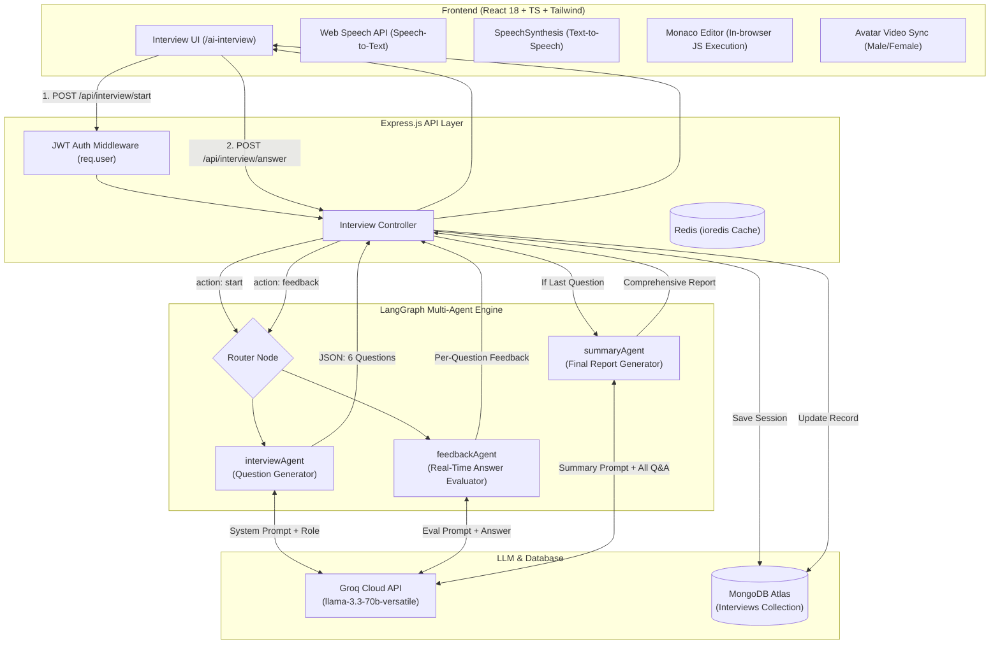
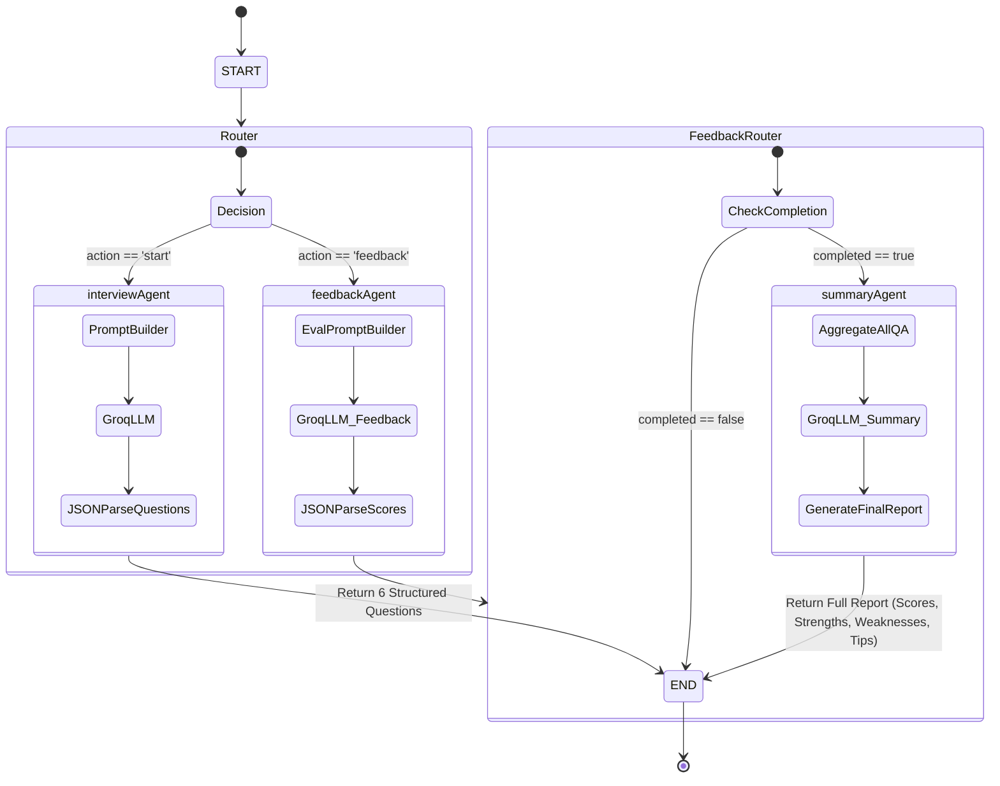

# 🧠 AI Interviewer: Complete Architecture, System Design & Conduction Analysis

This document provides a comprehensive technical breakdown of the **AI Interviewer System** integrated into HireOn. It covers the end-to-end architecture, LangGraph state machine, prompt engineering, conduction patterns, model choices, multi-modal pipelines, scoring rubrics, and detailed optimization roadmaps.

---

## 📑 Table of Contents
1. [System Overview & High-Level Architecture](#1-system-overview--high-level-architecture)
2. [AI Model & Inference Provider](#2-ai-model--inference-provider)
3. [LangGraph State Machine & Workflow Graph](#3-langgraph-state-machine--workflow-graph)
4. [Interview Conduction Pattern & Difficulty Curve](#4-interview-conduction-pattern--difficulty-curve)
5. [Timing & Cognitive Pressure Dynamics](#5-timing--cognitive-pressure-dynamics)
6. [Multi-Criteria Evaluation Rubric (8 Dimensions)](#6-multi-criteria-evaluation-rubric-8-dimensions)
7. [Multi-Modal Frontend Architecture](#7-multi-modal-frontend-architecture)
8. [Data Models & API Specifications](#8-data-models--api-specifications)
9. [Detailed Optimization & Enhancement Roadmap](#9-detailed-optimization--enhancement-roadmap)

---

## 1. System Overview & High-Level Architecture

The AI Interviewer is an autonomous, multi-agent mock interview platform designed to simulate real-world technical and behavioral hiring rounds with realistic pressure, dynamic questions, live coding, and instant multi-criteria evaluation.



---

## 2. AI Model & Inference Provider

### **Current Model:** `llama-3.3-70b-versatile` (via Groq)
- **Engine Provider:** [Groq Cloud LPU™ Inference Engine](https://groq.com)
- **Temperature:** `0.2` (Low temperature ensures structured JSON generation, consistent scoring, and minimal hallucination)
- **Max Retries:** `2`
- **Why Groq + Llama 3.3 70B?**
  1. **Ultra-Low Latency (~250-400ms TTFT):** Groq's LPUs (Language Processing Units) deliver 250-300+ tokens per second. In a live interview simulation, candidate wait time between questions or feedback is virtually zero.
  2. **High Reasoning Fidelity:** Llama 3.3 70B matches or exceeds GPT-4o-mini across coding benchmarks (HumanEval), system design comprehension, and structured reasoning.
  3. **Strict JSON Schema Compliance:** Clean output without conversational noise or stray markdown delimiters.

---

## 3. LangGraph State Machine & Workflow Graph

The orchestration is implemented with `@langchain/langgraph` utilizing a typed state graph.



### **State Channels (`InterviewState`):**
```javascript
const InterviewState = Annotation.Root({
  action: Annotation(),      // 'start' | 'feedback'
  type: Annotation(),        // 'technical' | 'hr'
  role: Annotation(),        // e.g. 'Backend Developer'
  useResume: Annotation(),   // Boolean flag
  resume: Annotation(),      // Resume data object (summary, skills, projects)
  questions: Annotation(),   // Array of 6 generated questions
  question: Annotation(),    // Current question text
  answer: Annotation(),      // Candidate answer string
  difficulty: Annotation(),  // 'easy' | 'medium' | 'hard'
  feedback: Annotation(),    // Real-time scores & feedback object
  report: Annotation(),      // Final synthesized report object
  completed: Annotation(),   // Boolean flag: last question reached?
});
```

---

## 4. Interview Conduction Pattern & Difficulty Curve

Each interview consists of **exactly 6 questions** designed with an authentic corporate hiring progression.

```
Question 1 (Easy)    ──► Conceptual Fundamentals & Basics
Question 2 (Easy)    ──► Core Architectural Concepts / Definitions
Question 3 (Medium)  ──► Comparative Analysis & Real-World Scenarios
Question 4 (Hard)    ──► System Design, Failure Scenarios, Edge Cases
Question 5 (Hard)    ──► Practical Scenario (Non-coding) OR Live Coding (Dev roles)
Question 6 (Hard)    ──► In-depth Implementation Challenge (Dev roles) OR Case Resolution
```

### Conduction Breakdown by Track:

#### **A. Technical Track (Software / Data / DevOps / Engineering)**
- **Questions 1–4 (Conceptual & Architectural):**
  - Evaluates framework internals, async runtimes, database indexing, caching strategies, distributed systems, state management.
- **Questions 5–6 (Live Coding & Practical Implementation):**
  - Dev roles receive coding challenges (e.g. *LRU Cache, Rate Limiter, Linked List manipulation, Debounce implementation*).
  - Candidates can open the integrated **Monaco Code Editor**, write solutions in JavaScript/TypeScript/Python/C++/Java, run JavaScript directly in-browser, and submit code alongside their answer.

#### **B. Behavioral & HR Track**
- Evaluates communication, conflict resolution, leadership, situational judgment, pressure handling, and cultural fit.
- Questions follow the **STAR methodology** (*Situation, Task, Action, Result*).

---

## 5. Timing & Cognitive Pressure Dynamics

Fixed timers do not reflect real interviews. The system assigns **dynamic timers** per question based on cognitive difficulty:

| Question Type | Allocated Time | Target Dynamic |
|---|---|---|
| **Basic Definition / Intro** | `60 – 75s` | Quick recall & crisp clarity |
| **Concept Explanation** | `75 – 120s` | Structured explanation |
| **Comparative / Architectural** | `120 – 180s` | Trade-off articulation |
| **Scenario & Debugging** | `180 – 300s` | Root-cause analysis & composure |
| **Coding Challenge (Easy)** | `300 – 420s` | Syntax & core logic |
| **Coding Challenge (Hard/Complex)**| `600 – 900s` | Algorithmic depth & edge handling |

---

## 6. Multi-Criteria Evaluation Rubric (8 Dimensions)

Every submitted answer is evaluated independently across **8 dimensions** (0–100 scale):

```
┌──────────────────────┬────────────────────────────────────────────────────────┐
│ Dimension            │ Description & Focus                                    │
├──────────────────────┼────────────────────────────────────────────────────────┤
│ 1. Correctness       │ Technical precision, factual accuracy, absence of bugs  │
│ 2. Clarity           │ Coherent structure, crisp articulation, no rambling    │
│ 3. Relevance         │ Direct alignment with the specific question asked     │
│ 4. Detail            │ Nuance, deep understanding, mention of edge cases      │
│ 5. Efficiency        │ Optimal time/space complexity or execution economy     │
│ 6. Communication     │ Professional tone, confidence, structured expression    │
│ 7. Problem Solving   │ Logical progression, deductive reasoning               │
│ 8. Creativity        │ Novel approaches, innovative trade-off balancing       │
└──────────────────────┴────────────────────────────────────────────────────────┘
```

### Prompt Guardrails for Realism:
- **Tone:** Direct, conversational, constructive (maximum 2 sentences).
- **Anti-AI Language Rule:** Strictly forbids robotic phrases like *"The candidate demonstrated..."*, *"Based on your response..."*, or mentioning numerical scores in text.
- **Actionable Improvements:** Exactly 3 succinct, bulleted recommendations (< 10 words each).

---

## 7. Multi-Modal Frontend Architecture

The client side leverages browser-native APIs for a zero-cost, high-performance multimedia experience:

```
                          ┌──────────────────────────┐
                          │   SpeechRecognition      │ (Web Speech API)
                          │   Continuous: true       │ ──► Live Transcribe to Textarea
                          └──────────────────────────┘
                                       │
┌──────────────────────────┐           ▼            ┌──────────────────────────┐
│   SpeechSynthesis (TTS)  │ ◄─── User Interface ──►│   HTML5 Video Avatars    │
│   Voice Pitch: 1.05      │                        │   Synced loop with speech│
│   Rate: 0.92 (natural)   │                        │   (Male / Female)        │
└──────────────────────────┘                        └──────────────────────────┘
                                       │
                                       ▼
                          ┌──────────────────────────┐
                          │   Monaco Code Editor     │ (VS Code engine in browser)
                          │   Sandboxed Function()   │ ──► JS Terminal Runner
                          └──────────────────────────┘
```

- **Echo Prevention:** Microphone recognition is automatically paused while the AI avatar is speaking so the mic does not capture the AI's own synthesized voice.
- **Camera Stream:** Local WebRTC `navigator.mediaDevices.getUserMedia` mirrored locally for realistic posture checks without incurring server streaming bandwidth.

---

## 8. Data Models & API Specifications

### MongoDB Schema (`Interview`):
```javascript
{
  userId: ObjectId,
  type: "technical" | "hr",
  role: "Backend Developer",
  useResume: Boolean,
  currentQuestion: Number,
  questions: [
    {
      question: String,
      userAnswer: String,
      difficulty: "easy" | "medium" | "hard",
      timer: Number,
      feedback: {
        score: Number,
        correctness: Number,
        clarity: Number,
        relevance: Number,
        detail: Number,
        efficiency: Number,
        communication: Number,
        problemSolving: Number,
        creativity: Number,
        feedback: String,
        improvements: [String]
      }
    }
  ],
  overallScore: Number,
  strengths: [String],
  weaknesses: [String],
  recommendations: [String],
  summary: String,
  status: "in-progress" | "completed"
}
```

### Endpoints:
- `POST /api/interview/start` &mdash; Validates role & type, invokes LangGraph, saves new interview session.
- `POST /api/interview/answer` &mdash; Evaluates answer, updates scores, triggers summary if completed.
- `GET /api/interview/:id` &mdash; Fetches single session / final report.
- `GET /api/interview/all` &mdash; Retrieves full candidate interview history with aggregate skill radar analytics.

---

## 9. Detailed Optimization & Enhancement Roadmap

To elevate the system from a prototype to an enterprise-grade AI assessment engine, here are actionable optimization avenues:

### 1. 🚀 Ultra-Low Latency Voice (WebRTC + LiveKit)
- **Current:** Browser Web Speech API & SpeechSynthesis.
- **Upgrade:** Integrate **Cartesia / Deepgram (STT) + ElevenLabs / OpenAI Realtime API (TTS)** via WebRTC.
- **Benefit:** Sub-200ms spoken turn-around, support for conversational interruptions (candidate interrupts interviewer or vice versa).

### 2. ⚡ Streaming Responses & Agent Speculation
- **Current:** Batch JSON invoke for feedback after submission.
- **Upgrade:** Stream LangGraph token output via Server-Sent Events (SSE) so the UI displays feedback and begins vocalizing the first sentence immediately.

### 3. 💻 Multi-Language Code Judge Sandbox
- **Current:** Browser-side `new Function()` execution for JavaScript only.
- **Upgrade:** Connect to a secure containerized code execution sandbox (e.g. **Judge0 API** or isolated Docker microservice) supporting Python, Java, C++, Go, and Rust with test suites.

### 4. 📄 Resume RAG & Target Job Description Embedding
- **Current:** Plain string injection of resume data into prompt.
- **Upgrade:** Vector embeddings (e.g., using `text-embedding-3-small`) to retrieve exact project accomplishments and tailor questions directly against specific bullet points on the candidate's resume.

### 5. 📊 Recruiter Analytics & Cheat Detection
- Add candidate eye-tracking/tab-switch detection, speech pace metrics (WPM), filler-word counter ("um", "like", "actually"), and recruiter PDF export with hire/no-hire recommendations.
